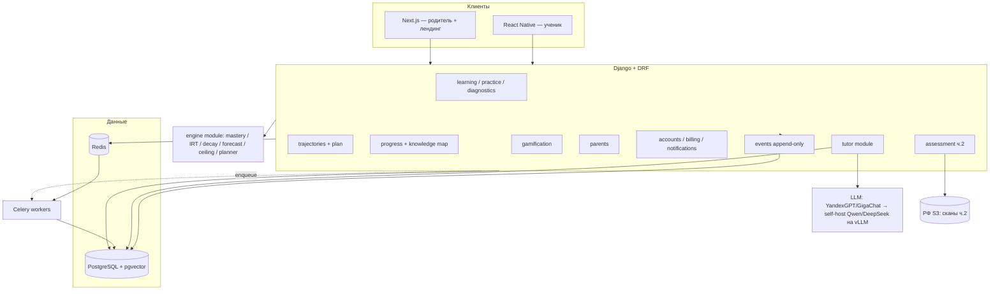

# Матемация — платформа (контекст для Claude Code)

> Этот файл — источник правды по архитектуре и конвенциям проекта. Положи его в корень
> репозитория. Claude Code читает его автоматически и должен опираться на него при
> генерации кода: следовать выбранному стеку, не вводить альтернативные технологии без
> явной причины, уважать доменную модель и ограничения ниже.

---

## 1. Что мы строим

Матемация — **гибридный сервис управляемой подготовки к ЕГЭ по профильной математике**.
Не «ИИ-репетитор» и не «контентная платформа с нейросетью», а **goal-based hybrid service**:
ИИ строит и перестраивает траекторию к целевому баллу (адаптивность и дисциплина ритма),
а **эксперт ЕГЭ** отвечает за доверие, проверку сложного и методическую правоту.

Объект продажи — не урок и не чат, а **управляемый результат подготовки**.
Центральные сущности продукта: **карта навыков**, **именованные траектории + прогноз балла**,
**возврат ошибок в работу**, **эксперт в критическом контуре**.

### Два JTBD, под которые проектируем
- **Родитель:** «Понимать, на какой балл реально идёт ребёнок, не теряет ли время и что делать дальше — без ощущения хаоса.»
- **Ученик:** «Понимать, что учить сейчас, почему я ошибаюсь и как быстро поднять результат.»

---

## 2. Инварианты продукта (нарушать нельзя)

Это продуктовые контракты. Код, который им противоречит, — неверный, даже если технически работает.

1. **Человек в контуре доверия.** Проверка второй части и спорных решений — зона эксперта.
   ИИ может предразмечать, предлагать rubric hints, ускорять — но **не является финальным арбитром**.
2. **Оба контура проверки существуют.** Экспертная проверка (must, ядро доверия) и ИИ-пайплайн
   проверки под контролем человека — оба в скоупе. Разрез «бесплатно/апселл» ещё не зафиксирован —
   не зашивай его жёстко в модель, держи конфигурируемым.
3. **Наставник сократический.** По умолчанию ведёт наводящими вопросами (≤2), **никогда не выдаёт
   готовый ответ**, работает по проверенным разборам (RAG), помечает неуверенность. Отключён на
   пробниках и отработках.
4. **Анти-галлюцинации обязательны.** Любое числовое/алгебраическое утверждение наставника
   проходит символьную проверку (SymPy) до показа. Нет проверки — нет показа.
5. **Прогноз — это условный результат при текущем ритме, а не гарантия.** Никогда не подавай
   прогноз как обещание балла. Формулировки — «при текущем темпе», диапазоны, причинность.
6. **Траектория = именованный сценарий (78+/84+/90+).** План — это выбранная траектория; переход
   между траекториями происходит по событиям (плохой пробник / повторные ошибки на теме / долгий
   простой) и является заметным событием с причинами и «что вернуть».
7. **Ошибка не теряется.** Каждая ошибка → tagged misconception, привязка к узлу, возврат по
   интервальной схеме.
8. **Пайплайн событий с первого дня.** Каждая попытка решения пишется в append-only лог. Это
   будущий ML-датасет (cold start). Отсутствие лога = потеря главного актива.
9. **ФЗ-152.** ПДн граждан РФ хранятся в России. Это диктует хостинг, платежи, хранилище, часть
   сервисов. Проектируй с этим с самого начала.

### Чего НЕ делаем (антипаттерны скоупа)
Полностью автоматическая проверка второй части как единственный арбитр; «замена репетитора»
в логике продукта; наставник, выдающий готовый ответ; тяжёлые родительские дашборды; «занимайся
когда угодно» без управляемого ритма. Не переобучаем свою LLM с нуля — выигрыш в RAG по
курируемым разборам + человеческий слой, а не в качестве генерации.

---

## 3. Архитектура

**Модульный монолит на Python, не микросервисы.** Команда маленькая, продукт ранний. Один кодбейс;
ML-движок и ИИ-наставник вынесены в отдельные модули (не сервисы) с чистыми границами, чтобы позже
их можно было выделить под отдельное масштабирование/GPU. Сервис выделяем только когда модуль
реально упрётся в свой потолок (наставник — в GPU, движок — в нагрузку).



**Разделение синхронно/асинхронно:**
- **Синхронно (мгновенный отклик):** запись попытки, микрообновление mastery (BKT), пересчёт
  дельты балла и прогресса квеста, ответ ученику.
- **Асинхронно (Celery, ночью и после пробников):** симуляция потолка, полный реплан,
  пересчёт декея, ранжирование лиг, генерация недельных квестов.
- **Движку GPU не нужен** — это лёгкая арифметика на маленьком графе (~80–150 узлов). GPU нужен
  только наставнику при self-host LLM.

---

## 4. Технологический стек (зафиксировано)

| Слой | Выбор | Комментарий |
|---|---|---|
| Бэкенд-фреймворк | **Django + Django REST Framework** | Django Admin отдаёт CRUD-бэкофис методистов/экспертов почти бесплатно. Async точечно (ASGI) под отклик движка. |
| Форма архитектуры | **Модульный монолит** | Не микросервисы. Движок и наставник — выделяемые модули. |
| БД | **PostgreSQL** | Граф — смежность в таблицах + рекурсивные CTE (на 150 узлах летает, Neo4j не нужен). JSONB для гибких полей. Append-only лог попыток. |
| Векторный поиск | **pgvector** (расширение Postgres) | Отдельная векторная БД на старте не нужна. |
| Кэш / брокер / рейтинги | **Redis** | Кэш, брокер Celery, `sorted sets` для рейтингов лиг. |
| Очереди задач | **Celery + Redis** | Ночные джобы: потолок, реплан, декей, лиги, квесты. |
| Mastery | **pyBKT** (Bayesian Knowledge Tracing) | Open-source, настроить. Приоры от методистов. Позже — DKT/SAKT на накопленных логах. |
| Сложность заданий | **IRT 2PL** через `girth` / `py-irt` | Open-source, батч-калибровка. Bootstrap оценками методистов. |
| Забывание / интервалы | **FSRS** (`py-fsrs`) + экспон. декей mastery | Open-source, тюнить. Закрывает и «остывание» узлов, и интервалы отработки. |
| Прогноз балла | **свой модуль** | mastery × IRT → Σ ожидаемых баллов → таблица перевода ФИПИ. |
| Потолок | **своя симуляция** | Логистический рост mastery × дни × темп − декей, потолок по узлу. |
| Планировщик / реплан | **свой, детерминированный** | Жадный оптимизатор «баллы в час» с учётом рёбер графа. |
| LLM наставника | **YandexGPT / GigaChat** (старт, ФЗ-152) → **Qwen2.5-Math / DeepSeek-Math** на **vLLM** (self-host, юнит-экономика) | Абстракция провайдера с самого начала. Не обучаем свою модель. |
| RAG | **pgvector + multilingual-e5** (или эмбеддинги провайдера) | Граундинг наставника на эталонных разборах. |
| Гардрейлы наставника | **SymPy** | Символьная проверка шагов. |
| Символьная математика | **SymPy** | Проверка утверждений, генерация похожих задач. |
| OCR ч.2 (опц.) | **Mathpix** (сервис) или **pix2tex** (open-source) | Для человеческой проверки достаточно показать фото. |
| Мобильный клиент | **React Native** (общий TS-кодбейс) | Мобайл-first для ученика. Альтернатива — Flutter ради анимации дорожки (тогда код с вебом не делится). |
| Веб-клиент | **Next.js** | Родительский портал + лендинг. Общий TS с RN. |
| Видео | **Kinescope** или **VK Video** | Адаптивный битрейт, DRM, РФ-хостинг. Полноценный LMS (Moodle/Open edX) НЕ берём. |
| Хранилище сканов | РФ S3-совместимое: **Yandex Object Storage / VK Cloud / Selectel** | ФЗ-152. |
| Платежи | **ЮKassa** или **Тинькофф Касса** | Рекуррентные подписки, РФ. + документы под налоговый вычет; маткапитал вручную. |
| Аутентификация | **Django auth + JWT (simplejwt)** + **VK ID / Yandex ID** | Для школьников соц-вход важнее e-mail/пароля. Keycloak — оверкилл на старте. |
| Уведомления | **FCM** (Android) + **APNs** (iOS) + РФ SMS/почта | Движок напоминаний для стрика и квестов. |
| Хостинг | **Yandex Cloud / VK Cloud / Selectel** | ФЗ-152. Docker Compose на VM на старте; managed K8s — при масштабе. |
| CI/CD / IaC / мониторинг | **GitLab CI**, **Terraform**, **Prometheus + Grafana**, **Sentry** | |
| Продуктовая аналитика | **PostHog** (self-host) + свой event-лог + Яндекс Метрика | |

**Сквозной риск-флаг:** связка «Django ради админки + точечный async ради движка» — компромисс.
Весь ML-мир (pyBKT, SymPy, IRT, FSRS) живёт в Python — поэтому **не разрывай продукт на
Python-ML-сервис + Node-бэкенд** на старте. Если команда сильнее в Node/TS — это отдельный
разговор, но по умолчанию бэкенд Python.

---

## 5. Структура репозитория (целевая)

Django-проект с приложениями по модулям. Границы модулей = границы доменов WBS.

```
matemation/
├── CLAUDE.md
├── config/                  # settings (base/dev/prod), urls, asgi/wsgi, celery app
├── apps/
│   ├── common/              # общие утилиты, базовые модели, миксины, типы
│   ├── accounts/            # профили, VK/Yandex ID, JWT, роли (ученик/родитель/эксперт/методист)
│   ├── domain/              # МОАТ: граф знаний (узлы, рёбра), банк задач, эталонные решения,
│   │                        #        маппинг ФИПИ, таблица перевода баллов
│   ├── engine/              # ЧИСТЫЙ PYTHON, без ORM в ядре: mastery, irt, decay,
│   │                        #        forecast, ceiling, planner (сервисы + адаптеры к данным)
│   ├── progress/            # состояние mastery ученика, статусы узлов, забывание
│   ├── trajectories/        # именованные траектории, правила перехода, персональный план
│   ├── diagnostics/         # входной пробник, skill-диагностика, назначение траектории
│   ├── practice/            # пробники, отработка (полка ошибок), интервальные повторы
│   ├── learning/            # прохождение задач, «дорожка» (порядок уроков)
│   ├── tutor/               # LLM-провайдеры, RAG, сократическая оркестрация, SymPy-гардрейлы
│   ├── assessment/          # проверка ч.2: экспертный контур + ИИ-пайплайн, SLA, разметка ошибок
│   ├── parents/             # родительский вход, «реальный балл», weekly pulse, лог наставника
│   ├── gamification/        # стрик, XP, лиги, валюта/магазин, квесты
│   ├── billing/             # подписки, платежи, апселлы
│   ├── notifications/       # push/SMS/почта, движок напоминаний
│   └── events/              # append-only лог попыток и событий → PostHog/ClickHouse позже
├── clients/
│   ├── mobile/              # React Native (ученик)
│   └── web/                 # Next.js (родитель + лендинг)
├── infra/                   # Terraform, docker-compose, CI
└── tests/
```

**Ключевые правила модульности:**
- `engine/` не импортирует Django ORM в своём ядре — принимает данные через интерфейсы/DTO,
  чтобы оставаться выделяемым и юнит-тестируемым в изоляции.
- `tutor/` изолирован за абстракцией `LLMProvider`; смена YandexGPT→vLLM не должна трогать остальной код.
- Кросс-модульные вызовы — через сервисные функции, не через прямой доступ к чужим моделям.

**Соответствие текущего MVP:** чистое ядро находится в `apps/engine`; сервисы
`apps/knowledge`, `apps/progress` и `apps/planning` являются Django/ORM-адаптерами,
которые собирают DTO и передают настройки движку явно.

---

## 6. Доменная модель (ядро — это моат, а не ML)

Всё стоит на двух датасетах, которых в готовом виде не существует и которые создают методисты:
**граф знаний** и **размеченный банк задач + эталонные решения**. Это самый недооценённый по
стоимости блок и именно он определяет качество продукта.

### Основные сущности (эскиз, не финальная схема)

```
SkillNode            # узел графа знаний (гранулярный навык)
  id, cluster, title, ege_tasks[], theory_ref, difficulty_prior
  status_model: closed | available | in_progress | mastered | decayed
  # ~80–150 узлов. НЕ «Стереометрия», а «угол между плоскостями», «объём усечённой пирамиды».

SkillEdge            # рёбра-зависимости (prerequisite graph)
  from_node, to_node, kind (prerequisite)

Task                 # задача из банка
  id, ege_prototype, part (1|2), difficulty (IRT params), answer,
  nodes[] (M2M на SkillNode), source

ReferenceSolution    # эталонное пошаговое решение (питает RAG + проверку)
  task_id, steps[], fipi_criteria[] (для ч.2), embedding (pgvector)

ScoreTable           # перевод первичных → тестовых баллов, конфиг ПО ГОДАМ
  year, mapping

MasteryState         # состояние ученика по узлу
  user_id, node_id, p_mastery (0..1), last_practice_at, decay_level, status

Attempt              # APPEND-ONLY, пишется с дня 1
  user_id, task_id, node_ids[], correct, time_spent, attempts_count,
  hints_used, created_at        # это будущий ML-датасет

Misconception        # tagged ошибка
  attempt_id, node_id, type (algebraic_slip | incomplete_argument |
  wrong_method | rubric_miss | graph_misread | ...), scheduled_reviews[]

Trajectory           # именованная траектория (78+/84+/90+)
  target_range, weekly_load, checkpoints[], part1_part2_split,
  critical_nodes[], allowed_skips, expected_mock_dynamics, confidence

TrajectoryTransition # событие смены траектории
  user_id, from, to, reasons[], recovery_actions[], created_at

Part2Submission      # проверка второй части
  user_id, mock_id, image_url (РФ S3), status, sla_deadline,
  reviewer_id, criteria_scores[], comment, error_tags[]
```

**Хранение графа:** обычные таблицы `SkillNode` + `SkillEdge`, обходы зависимостей — рекурсивные
CTE. Neo4j только если обходы реально усложнятся (пока не нужен).

---

## 7. Ключевые алгоритмы

### 7.1 Mastery (open-source, настроить)
BKT на pyBKT с приорами от методистов. Микрообновление узла **после каждой задачи** (дёшево,
синхронно). Позже — DKT/SAKT на логах.

### 7.2 Сложность (open-source, настроить)
IRT 2PL через girth/py-irt, батч-калибровка. Bootstrap оценками методистов/демоверсий → уточнение
на данных.

### 7.3 Забывание (open-source, тюнить)
FSRS для интервалов отработки + экспоненциальный декей mastery по времени. После паузы узлы
«остывают», статус → `decayed`, узел сам возвращается в план.

Текущий bootstrap без внешней библиотеки использует чистую FSRS-подобную функцию: базовая
лестница 1/3/7/30 сжимается в 0,5 раза за повторный провал, а успешный повтор растягивает
следующий интервал с ease 1,6 в границах 1–60 дней.

### 7.4 Прогноз балла (КАСТОМ)
```
текущий_первичный = Σ по заданиям  P(верно | mastery, IRT_params) × макс_балл_задания
тестовый_балл      = ScoreTable[year].map(текущий_первичный)
```
Калибруется по факту: после каждого пробника сверяем предсказание с фактом, подтягиваем модель.
Bootstrap v2 реализует 2PL-логистику в чистом Python: mastery и difficulty 1–5 отображаются в
общую логит-шкалу; сумма ожидаемых баллов нормируется к максимуму первичного балла. EMA-калибровка
по пробникам применяется поверх результата.

### 7.5 Потолок (КАСТОМ — самый новый алгоритм, готового решения нет нигде)
Детерминированная симуляция: на оставшиеся дни при заданном темпе моделируем логистический рост
mastery по каждому доступному узлу к его потолку, вычитаем декей, пересчитываем балл. «Рычаги»
(ползунок темпа/даты) = перезапуск симуляции с другими параметрами. Всё на чистом Python, кэшируется.

### 7.6 Планировщик / реплан (КАСТОМ, детерминированный)
При графе, рёбрах-зависимостях, «весе в баллах» узла, бюджете времени и декее — выбрать
упорядоченный набор узлов, максимизирующий прирост ожидаемого балла на единицу времени. Жадная
эвристика «баллы/час» с соблюдением рёбер. Это НЕ ML.
В v2 на каждом шаге дельта считается повторным IRT-прогнозом при достижимом mastery выбранного
узла; уже выбранные пререквизиты считаются изученными, а циклы и битые рёбра уходят в защитный хвост.

**Runtime попытки:** ученик решает → API пишет `Attempt` → BKT-микрообновление (синхронно, мгновенно)
→ пересчёт дельты балла и прогресса квеста → ответ с обновлённым mastery. Тяжёлое (симуляция потолка,
полный реплан, декей, лиги) — ночью в Celery и после пробников.

---

## 8. ИИ-наставник — контракт безопасности (4 барьера)

Модель сторонняя, ценность — в обвязке. Оркестрацию пиши тонкой своей (шаблоны промптов + ретрив
+ SymPy-чек); не тащи целиком LangChain/LlamaIndex — аудируемость важнее «батареек».

1. **RAG-граундинг:** объяснять из найденного верного решения (эталонного разбора), а не
   генерировать свободно. pgvector + multilingual-e5, в контекст кладётся проверенное решение + теория.
2. **SymPy-проверка:** любое алгебраическое/числовое утверждение модели проверяется символьно
   **до показа**. Не прошло — не показываем.
3. **Выходной фильтр:** «никогда не раскрывать финальный ответ» — модель отдаёт *уровень подсказки*
   (наводящий вопрос, ≤2), а не решение.
4. **Отключение** наставника на пробниках и отработках.

Плюс: пометки неуверенности, в спорных местах — предложение «спросить живого преподавателя».
Лог общения виден в родительском контуре (детально по кнопке; в сводке — только счётчик подсказок).

---

## 9. Проверка второй части

Технически почти нет ML — это **операционка + пайплайн**.
- Ученик загружает фото/скан развёрнутого решения → РФ S3-хранилище.
- **Экспертный контур (must):** форма проверки по критериям ФИПИ, эксперт возвращает баллы по
  каждому критерию + комментарий «где потерял балл». SLA (напр. 48 ч), трекинг, выплаты.
- **ИИ-пайплайн (should):** OCR (Mathpix/pix2tex) → предразметка → guess rubric → **человек
  подтверждает**. ИИ не финальный арбитр (инвариант №1). Осторожная внешняя коммуникация про ИИ-проверку.
- **Экспертная разметка ошибок** (`error_tags`) — не просто балл, а типизация misconception. Это
  превращает дорогой человеческий слой в обучающий двигатель системы.
- Результат пробника → перекалибровка прогноза.

Разрез бесплатно/апселл для обоих контуров **не зафиксирован** — держи конфигурируемым, не зашивай.

---

## 10. Данные и холодный старт

На запуске логов учеников НЕТ. Стартуем на бутстрапе, поэтому **пайплайн логирования каждой
попытки должен быть в продукте с первого дня**:
- mastery — BKT с приорами методистов;
- сложность — оценки методистов/демоверсий → уточнение через IRT;
- декей — дефолты FSRS;
- прогноз — прозрачное правило (mastery × вес → первичные → таблица ФИПИ), калибруется по пробникам.

Сложные DKT и точные параметры подключаем **после** накопления данных. Event-лог — append-only,
Postgres; когда аналитика упрётся — добавим ClickHouse. Kafka не городим.

---

## 11. Конвенции разработки

- **Язык бэкенда:** Python 3.12+. Форматирование — `ruff` + `black`. Типизация приветствуется
  (mypy на `engine/` и `tutor/` обязательна — там цена ошибки высокая).
- **Django:** fat services / thin views. Бизнес-логика в сервисном слое (`apps/<mod>/services.py`),
  не во вьюхах и не в моделях. Модели — данные + инварианты.
- **Миграции:** каждая схема-правка = миграция в PR. Никаких ручных правок БД.
- **API:** DRF, версионирование `/api/v1/`. Сериализаторы отдельно от бизнес-логики.
  Именуй ресурсы тем, что контролирует пользователь, а не как устроена система.
- **Async:** точечно (ASGI) только там, где нужен мгновенный отклик движка. Не переписывай всё на async.
- **Celery:** идемпотентные таски, ретраи с backoff. Тяжёлые джобы — только сюда.
- **Тесты:** `pytest`. `engine/` покрывать юнит-тестами в изоляции (без БД). Критические
  инварианты продукта (раздел 2) — покрывать тестами явно (напр. «наставник не раскрывает ответ»,
  «прогноз не подаётся как гарантия» на уровне API-контракта).
- **Секреты:** через env / секрет-менеджер, никогда в кодбейсе.
- **ПДн:** любые данные школьников/родителей — в РФ-периметре (ФЗ-152). Не логируй ПДн в Sentry/PostHog.
- **Наименование:** домен по-русски в UI-текстах, код и идентификаторы — по-английски
  (`SkillNode`, `mastery`, `Trajectory`). Не смешивай.

---

## 12. Порядок сборки (по релизным волнам)

Соответствует roadmap. Сначала фундамент и моат, затем движок, затем циклы обучения и проверка.

- **Волна 0 — фундамент и моат:** `config`, `accounts`, `domain` (граф + разметка + эталонные
  решения — критический путь, труд методистов), `events` (лог с дня 1), платформа-ядро
  (Postgres+pgvector, Redis, Celery, Django Admin для бэкофиса), ФЗ-152-периметр.
- **Волна 1 — ядро движка:** `engine` (mastery/IRT/decay/forecast/ceiling/planner), `progress`
  (карта знаний, статусы), `trajectories` (модель траекторий + правила перехода + план).
- **Волна 2 — цикл обучения:** `diagnostics` (входной пробник), `practice` (пробники, отработка),
  `learning` (дорожка), `tutor` (наставник с гардрейлами).
- **Волна 3 — проверка/родитель/клиенты:** `assessment` (оба контура ч.2), `parents`,
  `clients/mobile` + `clients/web`.
- **Волна 4 — вовлечение/валидация:** `gamification` (последний приоритет), MVP-тест на
  бутстрап-данных, калибровка на реальных логах.

**Критический путь:** `domain` (2.x) → `engine` прогноз/потолок (3.4→3.5) → `trajectories` (4.x)
→ MVP-запуск (15.1). Всё остальное навешивается вокруг него.

---

## 12а. Что уже сделано (состояние на 2026-08-01)

Раздел описывает фактическое состояние ствола `feature/full-platform-mvp` и
решения, которые изменили или уточнили концепцию выше. Он не отменяет
инварианты раздела 2 — он показывает, как они реализованы.

### Реализованные блоки

| Блок | Где | Существенное |
| --- | --- | --- |
| Движок | `apps/engine` | чистое ядро с DTO: IRT 2PL, greedy-планировщик, забывание, потолок; тесты на чистоту |
| Профиль экзамена | `apps/exams` | `ExamProfile`/`ExamTask` на год: прогноз считается по структуре экзамена, а не по банку задач |
| Прогноз | `apps/progress` | калибровка в первичных баллах, интервал, история «прогноз — факт», разбор по заданиям |
| Граф | `apps/knowledge` | часы на узел, пороги `min_mastery` на рёбрах, запрет циклов при сохранении |
| Обучение | `apps/content` | публикация уроков, видео через провайдера (Kinescope), версии заданий, домашки, задание дня |
| Отработка | `apps/practice` | полка ошибок с типами, интервальные повторы, привязка попытки к версии задания |
| Вовлечение | `apps/gamification`, `apps/economy` | XP, уровни, стрики, квесты; монеты и магазин косметики |
| Роли и бэкофис | `apps/web`, `apps/adminpanel` | кабинеты ученика, родителя, эксперта, методиста; панель администрирования |
| Деньги | `apps/billing` | версионируемые тарифы, подписки, идемпотентные платежи за провайдер-интерфейсом |
| Приватность | `apps/expert_review` | приватное хранилище работ, доступ по объектным правам, `config/security.py` |
| Навыки агентов | `agent-skills`, `scripts` | 50 собственных скиллов (12 — governance), реестр vendor с базовой линией аудита |

### Уточнения концепции

1. **Прогноз описывает экзамен, а не банк задач.** Раньше он строился по
   загруженным заданиям и нормировался на их сумму, поэтому загрузка контента
   двигала прогноз всем ученикам (замер: +10 тестовых баллов). Источник истины —
   `ExamProfile`; незамапленные задания дают ноль и видны в
   `exam_profile_coverage`.
2. **Калибровка живёт в первичных баллах** и применяется до нелинейной таблицы
   перевода; ученику показывается интервал, а не одно число.
3. **Стоимость темы измеряется часами узла**, а не числом узлов: только так
   «баллы за час» в планировщике имеют смысл.
4. **Две валюты разделены по смыслу:** XP отвечает за прогресс, уровни и стрики,
   монеты — за покупки косметики. Монеты начисляются из той же точки, что и XP,
   по курсу `COINS_PER_XP`. Косметика не влияет на обучение и прогноз.
5. **Роль методиста ведёт платформу.** Доступ к панели даёт роль, а не флаг
   `is_staff`; эксперт работает только со своей очередью.
6. **Контент публикуется явно.** Урок создаётся черновиком и появляется у
   ученика только после публикации; пустой урок опубликовать нельзя.
7. **Задание правится новой версией**, попытка хранит ту версию, которую видел
   ученик.
8. **Работы второй части — приватные файлы** вне `MEDIA_ROOT`, отдаются только
   по объектным правам; отказ — 404, а не 403.
9. **Видеохостинг — Kinescope, LLM наставника — DeepSeek.** Оба за
   провайдер-интерфейсами; наставник и боевой эквайринг подключаются последними.

### Корректировки по итогам первой примерки (2026-08-01)

10. **План закрывается сам.** Пункт «урок» закрывается верной задачей темы,
    «практика» — когда тема освоена до порога, «отработка» — успешным
    повтором. План — обещание сервиса, а не ручной чек-лист; автозакрытие
    платит XP и монеты так же, как ручное, и двигает недельные квесты.
11. **Ответ ученика виден сразу.** Ответ возвращает прогресс по темам задачи
    (освоение, решено из скольких, какие пункты плана закрылись), урок
    показывает это под задачей, дорожка — счётчик «задачи N/M» рядом с
    состоянием узла.
12. **Магазин — часть кабинета**, а не только API: страница `/shop/`,
    пункт в навигации и ссылка из раздела «Куда дальше».

### Достройка контура ученика (2026-08-01, вторая итерация)

13. **Домашки и задание дня — страницы, а не только API.** `/homework/`
    показывает прогресс, дедлайн и просрочку, каждая задача ведёт на занятие по
    своей теме; `/daily/` даёт решить задачу дня прямо на странице и не пускает
    решать её второй раз. Домашка закрывается сама, где бы задачу ни решили.
14. **Вход в продукт — по коду приглашения.** Страница `/invite/` (и ссылка
    `/invite/<код>/` с уже заполненным кодом) заводит аккаунт, профиль роли и
    группу. Ошибка в коде, слабый пароль или занятый логин код не сжигают.
    Пароли проходят валидаторы Django — ученик задаёт пароль сам, поэтому
    политика стойкости нужна и вне админки.
15. **Профиль экзамена размечен полностью.** Демо-граф закрывает все 19 номеров
    (добавлены векторы, прикладные формулы, графики функций, текстовые задачи,
    экономическая задача, числа и их свойства). Пустая разметка молча занижала
    прогноз, поэтому полнота покрытия проверяется тестом.
16. **Проверки идут в CI.** `.github/workflows/ci.yml` на `windows-latest`
    гоняет миграции, `manage.py check`, весь набор тестов и обе проверки системы
    навыков. Windows выбран потому, что проект на нём разрабатывается и
    запускается.

### Оформление и деньги (2026-08-01, третья итерация)

17. **Интерфейс собран вокруг знака.** Палитра выведена из логотипа: индиго
    Σ, пламя и барвинок. Цвет несёт смысл — индиго ведёт вперёд, зелёный
    значит освоено, охра подзабылось, красный риск; пламя оставлено стрику и
    наградам. Заголовки набраны с засечками, все баллы и проценты —
    моноширинным с выключкой по разряду. Есть тёмная тема, навигация
    переехала в левый рельс: разделов больше десяти и в строку они не
    помещались.
18. **Карта навыков — граф.** Координаты считает сервер, поэтому картинка
    одинакова в браузере и в тестах; клик по теме оставляет только цепочку
    её пререквизитов. Список тем остался вторым видом.
19. **Шкала прогноза всегда в первичных баллах.** Цель и потолок подписаны
    на той же оси, тестовые даны переводом: он нелинейный, и смешивать
    единицы на одной линейке нельзя.
20. **Внутренняя валюта — сигмы.** Жетон повторяет Σ из знака; золотая
    монета убрана, потому что тянула за собой казино, а не математику.
21. **Цена живёт на витрине `/pricing/`.** Страница открыта без входа: цену
    смотрят родители до регистрации. Тариф версионируется, а скидка —
    отдельное временное правило поверх него: у акции есть срок, лимит
    применений и список тарифов. Промокод имеет приоритет над автоматической
    скидкой, иначе непонятно, сработал код или нет. Эквайринг не подключён:
    способ оплаты с пустым `provider_key` — «оплата через куратора», и
    витрина говорит это прямо.

---

## 13. Что открыто (не зашивай жёстко)

Держи конфигурируемым / за флагами — эти решения ещё не приняты:
- монетизация проверки ч.2 (эксперт vs ИИ, бесплатно vs апселл) — считается в unit-экономике;
- лимит и монетизация подсказок наставника — unit-экономика;
- частота занятий: авто-определение vs ручной выбор — unit-экономика;
- формат стрика: недельный vs дневной — проверяется на MVP;
- формулировки названий статусов узлов — финализируются позже (сама статусная модель верна);
- «карточка изменений плана» — включается после валидации спроса.

---

## 14. Глоссарий

- **Узел (SkillNode)** — гранулярный навык в графе знаний.
- **mastery** — вероятность освоения узла (0..1), оценивается BKT.
- **декей / забывание** — падение mastery со временем (FSRS + экспон.); узел «остывает».
- **траектория** — именованный сценарий движения к диапазону баллов (78+/84+/90+).
- **прогноз / потолок** — текущий условный балл и максимально достижимый при заданном темпе.
- **пробник** — экзамен в формате ЕГЭ; перекалибрует прогноз.
- **отработка** — полка ошибок с интервальными повторами.
- **misconception** — типизированная ошибка, привязанная к узлу.
- **эксперт ЕГЭ** — человек в критическом контуре проверки ч.2.
